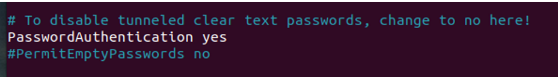
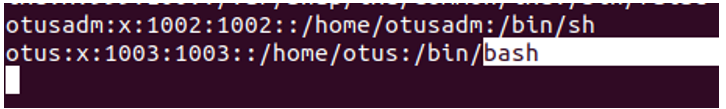

# homework-passwd

Описание домашнего задания
---
1. Научиться создавать пользователей и добавлять им ограничения.
2. Запретить всем пользователям кроме группы admin логин в выходные (суббота и воскресенье), без учета праздников

---
ОС для настройки: ubuntu 22_04

Vagrant версии 2.4.1

VirtualBox версии 7.0.18


---
- Этап 1: Выполнение ДЗ

После разворачивания ВМ из файла подключаемся по ssh.

**Создаём пользователей**

```bash
sudo useradd otusadm
sudo useradd otus
``` 


**Создаём пользователям пароли**

Вот тут я настрадался, конечно. Предлагаемые флаги команды в моей сборке не отрабатывали, почитал, это частая проблемка. Вместо passwd --stdin решил использовать команду chpasswd.

НО!!! мало того, что после рабочего дня не сильно соображаешь, и не обращаешь внимания, что в этой команде пароль и логин местами поменяны, кавычки, двоеточия..., так еще и при создании пользователей что-то не так пошло и автоматически не создались директории под них. Странная фигня, руками пришлось создать.


```bash
echo "otusadm:Usov2024!" | sudo chpasswd
echo "otus:Usov2024!" | sudo chpasswd
``` 


**Создаем группу**, Дабавляем пользюков

```bash
sudo groupadd -f admin
usermod otusadm -a -G admin
usermod root -a -G admin
usermod vagrant -a -G admin
# Не люблю я в одну строку писать команду, как в методичке. Потом визуально трудно вычитывать и искать их. Пошаговая реализация более приятна
``` 


**Пробуем подключиться**

```bash
ssh otus@192.168.56.101
``` 


У меня в вагранте нет команды, чтобы можно было по паролю подключаться, только по ключу (чудом допер до этой мысли). Лезем править, изнутри виртуалки

**Снимаем коммент, рестартим сервис** Кстати стоит отметить, что если я правильно понимаю команду из предложенного вагрант файла, она бы мне не помогла, потому что у меня все равно бы эта строка осталась закоментированная.  


```bash
nano /etc/ssh/sshd_config
systemctl restart sshd.service
``` 




**Не помогло** Это сейчас я спокойно пишу отчет, в тогда пригорело сильно) Где-то минут через 10 я понял, что пора доставать бубен и пускаться впляс.

**Лезем в логи**


Гуглил разное, пароль у пользователя есть, группа есть. ВСЁ ОК! но не работает

**После страданий** и вычитывания конфига, увидел интересную строку в конфиге

```bash
# В конфиге
nano /etc/ssh/sshd_config
# Есть такая строка
Include /etc/ssh/sshd_config.d/*.conf
``` 

Лезем туда и находим....


**Удивление, гнев, принятие…** Меняем на yes


Рестарт сервиса, Подключаемся 


**Стоит отметить**, что пользователи создались странно. После подключения им доступна sh, так сказать, а не bash
Это можно изменить руками вот тут

```bash
# В конфиге
nano /etc/passwd
``` 



---
- Этап 2: Настройка правила, по которому все пользователи кроме тех, что указаны в группе admin не смогут подключаться в выходные дни 

Смотрим, кто у нас живет в группе admin

```bash
 cat /etc/group | grep admin
``` 


**Создадим файл-скрипт** Даем разрешение на исполнение файла 

```bash
 /usr/local/bin/login.sh
chmod +x /usr/local/bin/login.sh
```

Тело скрипта:
```bash
#!/bin/bash
#Первое условие: если день недели суббота или воскресенье
if [ $(date +%a) = "Sat" ] || [ $(date +%a) = "Sun" ]; then
 #Второе условие: входит ли пользователь в группу admin
 if getent group admin | grep -qw "$PAM_USER"; then
        #Если пользователь входит в группу admin, то он может подключиться
        exit 0
      else
        #Иначе ошибка (не сможет подключиться)
        exit 1
    fi
  #Если день не выходной, то подключиться может любой пользователь
  else
    exit 0
fi
```


**Добавляем** в файл /etc/pam.d/sshd строку, которая будет запускать этот скрипт и проверять условия

```bash
#!/bin/bash
auth required pam_exec.so debug /usr/local/bin/login.sh
```

Пробуем подключиться в "выходной" обычным (не в группе админ) пользователем


